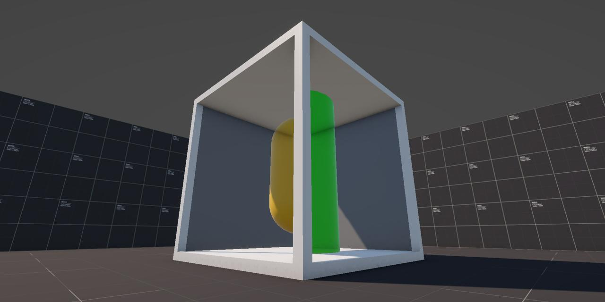

# Stencil Cube

A Unity shader that recreates the impossible cube illusion popularized by Antichamber. This effect uses the stencil buffer and layered objects to create geometry that appears physically impossible, yet remains coherent from player's viewport.

    

[Playable Demo](https://danielpokladek-shaders.github.io/stencil-cube/)

> Please note, the layered approach doesn't work on the Web build, but the standard read/write approach works as expected.

## Overview

At first look, the cube looks like ordinary cube with an object inside it, but when player's look at the other faces on the cube they will notice that each side shows a different object inside of it.

By selectively writing to and testing against the stencil buffer, different objects inside of the cube overwrite and occlude each other in non-Euclidean ways producing the illusion.

## How It Works

1) A stencil shader writes a custom ID to the stencil buffer.
2) Another stencil shader reads the value in buffer and carries out a comparison function, if the values match the pixel is overwritten.

The repo shows two approaches of achieving this effect:

- The original approach, this required a read/write shader for each ID and was the main material used on the objects - this meant that the default material couldn't be used on the object.
- A more flexible approach documented by Daniel Ilett, where the objects are placed on different layers and we carry out the stencil comparison on the render pipeline level - this allows for any material to be used on the objects, as stencil buffer compares against the layer.

## Specs

- Unity: **6.0.60f1 LTS**.
- Render Pipeline: **Universal Render Pipeline (URP)**

## License

Licensed under MIT License unless otherwise stated.